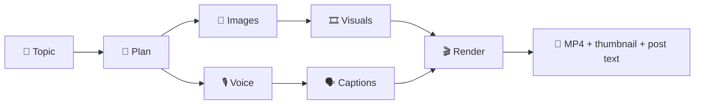

<p align="center"></p>

# Qoneqt Video Factory

> **Topic in → publish-ready Qoneqt Global Feed short out.**
> AI script, voice, visuals, karaoke captions and music in a 9:16 video. Add your photo and **you** present it.
> Also makes 4:5 image posts and carousels. Runs entirely on free tiers.

Built for **Qoneqt × CTRL FREAK 2026**: *"Build an LLM-Powered Content Pipeline for Qoneqt"*.

| | |
|---|---|
| 🌐 Live app | https://qoneqt-video-factory-ai.up.railway.app/ |
| 🎥 Demo video | https://canva.link/104yrj69lmkva1x |
| 📱 Published on Qoneqt | _coming soon_ |

<p align="center">
  
</p>

---

## 📌 Table of contents

1. [Problem](#-1-problem)
2. [Solution](#-2-solution)
3. [How it works](#-3-how-it-works)
4. [Tools and APIs](#-4-tools-and-apis)
5. [Run it locally](#-5-run-it-locally)

---

## 🎯 1. Problem

Qoneqt's **Global Feed** needs a steady flow of good short videos. Making them by hand is hard:

- ✍️ **Hooks**: the first 2 seconds decide if anyone keeps watching
- 🎙️ **Many skills**: script, voice, visuals and captions each need a different tool
- 🇮🇳 **Indian audience**: English, Hindi, Hinglish and Gujarati
- 👥 **Many communities**: each needs its own tone and hashtags
- 🔁 **Scale**: hours per video by hand
- 💸 **Cost**: paid AI APIs add up fast

---

## 💡 2. Solution

Pick **Video** or **Image**, a community, a language and a length. Type a topic or pick a trending one.
Get a finished video or post, a thumbnail and ready-to-paste post text.

- 🧠 **Strong hooks**: 3 scored openers per topic; the video uses the best one
- 🙋 **You in the video**: upload a photo and you present it, talking
- 🖼️ **Image posts and carousels**: a 4:5 picture or 2–4 slides from the same topic
- 🌐 **4 languages, 6 communities**: English, Hindi, Hinglish, Gujarati; each community has its own tone and hashtags
- 🎨 **4 looks, 4 lengths**: Photo, Anime, Infographic, Cinematic; 15 / 30 / 45 / 60 s
- 📈 **Trending ideas**: topic suggestions from Google Trends India
- ✏️ **Preview and edit**: change the script before rendering, redo any scene after
- 🗣️ **Karaoke captions and music**: word-by-word captions, music that ducks under the voice
- 🛡️ **Brand-safe**: risky claims are softened or blocked before rendering
- 📚 **Library and batch**: search, filter, save, download as ZIP; queue up to 10 topics
- 💰 **₹0 to run**: every provider is on a free tier, with fallbacks at each stage

<p align="center">
  
  
</p>

---

## ⚙️ 3. How it works



| # | Stage | What happens |
|---|---|---|
| 1 | **Plan** | LLM writes 3 scored hooks, scenes, caption, hashtags and post text; checked and safety-reviewed |
| 2 | **Images** | Two FLUX stills per scene in the chosen look |
| 3 | **Voice** | Narration to speech, recorded while images generate |
| 4 | **Visuals** | Zoom on each still; stock video or photo if images fail |
| 5 | **Captions** | Whisper times each word for karaoke captions |
| 6 | **Render** | ffmpeg adds crossfades, music, captions, title and end card |

**With your photo**

- **Restyle with AI** gives it a better outfit and light, same face
- First and last scenes: your face talks. Middle scenes: AI pictures with you in them
- If a step fails, a still portrait is used, so the video always finishes

**Image posts**

- One 4:5 picture or a 2–4 slide carousel, about 10 s each, on its own queue
- LLM writes headline, slide texts, caption, hashtags and alt text
- Use your own pictures or let FLUX draw them; redraw any slide alone

---

## 🧰 4. Tools and APIs

| Job | Primary | Fallback |
|---|---|---|
| 🧠 Script and ideas | Groq `gpt-oss-120b` | Groq Qwen → Gemini |
| 📈 Trends | Google Trends India | LLM-only ideas |
| 🎨 Images | Cloudflare FLUX.1-schnell | Together AI → Hugging Face |
| 🙋 Your photo | Cloudflare FLUX.2 klein | still portrait |
| 🗣️ Talking face | LeapTalk (HF Space) | MoDA → still photo |
| 🎙️ Voice | ElevenLabs | edge-tts → Gemini TTS |
| 🎞️ Stock | Pexels | Pixabay → Wikimedia |
| ⏱️ Word timing | Groq Whisper | even spread |

**Stack**: Python 3.11, FastAPI, ffmpeg 5.1, React 19 + Vite, pytest, Docker.
Music: 4 tracks by Kevin MacLeod (CC BY 4.0).

---

## 🚀 5. Run it locally

**Needs**: Python 3.11+, Node 20+, ffmpeg (`sudo apt install ffmpeg fonts-noto-core`), a free Groq key.

```bash
git clone https://github.com/darshit001/hackthn.git && cd hackthn

cd backend
python3 -m venv .venv && . .venv/bin/activate
pip install -r requirements.txt
cp .env.example .env                      # add your keys

cd ../frontend && npm install && npm run build
cd ../backend && uvicorn app.main:app --port 9000   # open http://localhost:9000
```

- **UI dev**: keep the backend on :9000, run `npm run dev` in `frontend/`, open http://localhost:8000
- **One video from CLI**: `python -m app.pipeline "why sleep matters" tech en 30`
- **Tests**: `python -m pytest -q` in `backend/`

**Keys** (all free)

| Variable | Get it at | Needed? |
|---|---|---|
| `GROQ_API_KEY` | [console.groq.com](https://console.groq.com) | ✅ yes |
| `GEMINI_API_KEY` | [aistudio.google.com](https://aistudio.google.com) | recommended |
| `CF_ACCOUNT_ID`, `CF_API_TOKEN` | [dash.cloudflare.com](https://dash.cloudflare.com) → Workers AI | recommended |
| `ELEVENLABS_API_KEY` | [elevenlabs.io](https://elevenlabs.io) | optional |
| `HF_TOKEN` | [huggingface.co/settings/tokens](https://huggingface.co/settings/tokens) | optional |
| `TOGETHER_API_KEY` | [api.together.ai](https://api.together.ai) | optional |
| `PEXELS_API_KEY`, `PIXABAY_API_KEY` | [pexels.com/api](https://www.pexels.com/api/), [pixabay.com/api/docs](https://pixabay.com/api/docs/) | optional |

Spare keys: add `_2`, `_3`, `_4` to any key name (`GROQ_API_KEY_2`, …). Used when the first runs out.

---

<p align="center">Made with ☕ for <b>Qoneqt × CTRL FREAK 2026</b></p>
