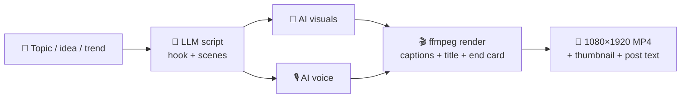
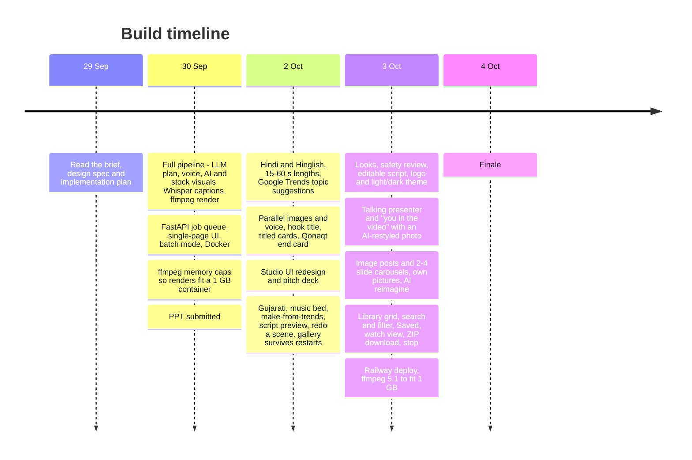
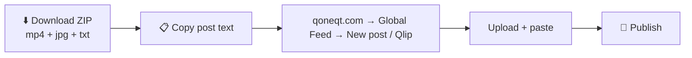

<p align="center"></p>

# Qoneqt Video Factory

> **Topic in → publish-ready Qoneqt Global Feed short out.**
> An LLM-powered pipeline that turns a topic, idea or trend into a 9:16 vertical video with an AI script, AI voice,
> AI or stock visuals, word-by-word captions, a hook title, a music bed that ducks under the voice and a Qoneqt end
> card. Add your photo and **you** present it, talking. The same topic can also become a 4:5 image post or a
> 2–4 slide carousel. It runs entirely on free tiers.

Built for **Qoneqt × CTRL FREAK 2026**, challenge: *"Build an LLM-Powered Content Pipeline for Qoneqt"*.

| | |
|---|---|
| 🌐 Live app | https://qoneqt-video-factory-ai.up.railway.app/ |
| 🎥 Demo video | https://canva.link/104yrj69lmkva1x |
| 📱 Published on Qoneqt | _coming soon_ |

<p align="center">
  
</p>

---

## 📌 Table of contents

1. [Problem statement](#-1-problem-statement)
2. [Our solution](#-2-our-solution)
3. [How it works (pipeline)](#-3-how-it-works-the-pipeline)
4. [Architecture](#-4-architecture)
5. [Tools, models and APIs](#-5-tools-models-and-apis)
6. [Reliability: fallback chains](#-6-reliability-fallback-chains)
7. [How we built it](#-7-how-we-built-it)
8. [Run it locally](#-8-run-it-locally)
9. [Deploy](#-9-deploy-hugging-face-spaces--docker)
11. [Repo layout](#-11-repo-layout)

---

## 🎯 1. Problem statement

**Qoneqt** is a community-first social platform: people find communities, connect around shared interests, and
create and share content. Its **Global Feed** needs a steady flow of good short videos.

The challenge brief asks:

> *How can AI help create high-quality, engaging video content for the Qoneqt Global Feed **at scale**?*
> Build and deploy an AI-powered system that turns **a topic, prompt, idea or trend** into **engaging video
> content**. The goal is not a single generation. It is a **repeatable pipeline** that produces
> **publish-ready content at scale**.

What makes this hard:

| Pain point | Why it matters |
|---|---|
| ✍️ Writing a script with a strong hook | The first 2 seconds decide whether anyone keeps watching |
| 🎙️ Voice, visuals and captions | Each needs a different tool and a different skill |
| 🇮🇳 Indian audience | Content has to work in English, Hindi, Hinglish **and** Gujarati |
| 👥 Many communities | Tech, fitness, finance and others each need their own tone, hashtags and style |
| 🔁 Scale | Doing this by hand takes hours per video, so the feed can't keep up |
| 💸 Cost | Paid AI APIs add up quickly, so the whole thing has to run on free tiers |

---

## 💡 2. Our solution

**Qoneqt Video Factory** is a web app plus a pipeline. You pick **Video** or **Image**, a **community**, a
**language** and a **length**, then type a topic or let the app **suggest topics from what India is searching
today**. A few minutes later you get a finished vertical video (or a picture post), a thumbnail and ready-to-paste
post text, all in a library you can search, filter, save and download from.



**Key features**

- 🧠 **Strong hooks**: 3 scored openers per topic; the video uses the best one
- 🙋 **You in the video**: upload a photo and you present it, talking
- 🖼️ **Image posts and carousels**: a 4:5 picture or 2–4 slides from the same topic
- 🌐 **4 languages, 6 communities**: English, Hindi, Hinglish, Gujarati; each community has its own tone and hashtags
- 🎨 **4 looks, 4 lengths**: Photo, Anime, Infographic, Cinematic; 15 / 30 / 45 / 60 s
- 📈 **Trending ideas**: topic suggestions from Google Trends India
- ✏️ **Preview and edit**: check and change the script before rendering, redo any scene after
- 🗣️ **Karaoke captions and music**: word-by-word captions, music that ducks under the voice
- 🛡️ **Brand-safe**: risky claims are softened or blocked before rendering
- 📚 **Library and batch**: search, filter, save, download as ZIP; queue up to 10 topics
- 💰 **₹0 to run**: every provider is on a free tier, with fallbacks at each stage

<p align="center">
  
  
</p>

---

## ⚙️ 3. How it works (the pipeline)

Each video goes through **six stages**. The UI shows live progress for each stage.


### Stage by stage

| # | Stage | What happens | Output |
|---|---|---|---|
| 1 | **Plan** | LLM writes 3 scored hooks, scenes sized to the length, caption, hashtags and post text. Checked and safety-reviewed. | `plan` dict |
| 2 | **Images** | Two FLUX stills per scene in the chosen look; voice records at the same time. | `gen<i>.png` |
| 3 | **Voice** | Narration to speech, voice picked by community and language. | `voice.wav` |
| 4 | **Visuals** | Zoom on each still (stock video or photo if images fail); long scenes cut between two shots. | `clip<i>.mp4` |
| 5 | **Captions** | Whisper times every word for karaoke captions. | `captions.ass` |
| 6 | **Render** | ffmpeg joins clips with crossfades, adds music, captions, title and end card. | `<id>.mp4`, `<id>.jpg` |

### With your photo ("You, talking")

- Upload a photo; **Restyle with AI** gives it a better outfit and light, same face.
- First and last scenes: your face talks. Middle scenes: AI pictures with you in them.
- If any step fails, a still portrait is used, so the video always finishes.

### Image posts

- One 4:5 picture or a 2–4 slide carousel, made in about 10 s each, on its own queue.
- LLM writes the headline, slide texts, caption, hashtags and alt text; same safety review.
- Use your own pictures or let FLUX draw them; redraw any slide alone.

---

## 🧰 5. Tools, models and APIs

### AI models and APIs

| Purpose | Primary | Fallback(s) | Key needed |
|---|---|---|---|
| 🧠 Script / plan / topic ideas | **Groq** `openai/gpt-oss-120b` | Groq `qwen/qwen3.8-27b` → **Gemini** `gemini-3.5-flash-lite` | `GROQ_API_KEY`, `GEMINI_API_KEY` |
| 📈 Trending topics | **Google Trends India** RSS | LLM-only ideas | none |
| 🎨 AI images | **Cloudflare Workers AI** FLUX.1-schnell | **Together AI** FLUX.1-schnell-Free → **Hugging Face** FLUX.1-schnell | `CF_ACCOUNT_ID` + `CF_API_TOKEN`; optional `TOGETHER_API_KEY`, `HF_TOKEN` |
| 🙋 Restyled photo, you in a scene | **Cloudflare Workers AI** FLUX.2 klein 4B (512×1024) | still portrait / plain FLUX.1 picture | `CF_ACCOUNT_ID` + `CF_API_TOKEN` |
| 🗣️ Talking face | **LeapTalk** (`hugging-apps/leaptalk-talking-head`) via `gradio_client` | **MoDA** (`multimodalart/MoDA-fast-talking-head`) → Ken Burns on the still photo | `HF_TOKEN` (ZeroGPU quota) |
| 🎙️ Voice | **ElevenLabs** `eleven_flash_v2_5` | **edge-tts** (Indian neural voices) → **Gemini TTS** | `ELEVENLABS_API_KEY` (optional) |
| 🎞️ Stock visuals | **Pexels** video | **Pixabay** video → **Wikimedia Commons** photos | Pexels / Pixabay optional; Commons needs none |
| 🗣️ Word timestamps | **Groq Whisper** `whisper-large-v3-turbo` | script words spread evenly over each scene | `GROQ_API_KEY` |

### Engineering stack

| Layer | Tool |
|---|---|
| Backend | **Python 3.11**, **FastAPI**, **Uvicorn** |
| HTTP | **httpx**, **gradio_client** (ZeroGPU Spaces) |
| Video / audio | **ffmpeg 5.1** (xfade crossfades, cover-crop, Ken Burns zoom, libass subtitle burn-in, posters, thumbnail) |
| Captions | **ASS** subtitle format with karaoke tags, **Noto** fonts (Latin, Devanagari, Gujarati) |
| Music | 4 tracks by Kevin MacLeod (incompetech.com, CC BY 4.0) in `backend/assets/music/`, 75 s, mono 64 kbps |
| Frontend | **React 19** + **Vite** in `frontend/`, plain CSS; built into `frontend/dist` and served by FastAPI |
| Tests | **pytest** (137 tests) + `node --test` for the library search, filter and sort |
| Container | **Docker**, two stages: `node:22-slim` builds the UI, `python:3.11-slim-bookworm` + ffmpeg 5.1 + fonts runs it |
| Hosting | **Railway** or **Hugging Face Spaces** (Docker, 1 GB box) |

---

## 🛠️ 7. How we built it



Design principles we followed:

1. **CLI first, UI second**: `python pipeline.py "topic"` produced a full video before any web code existed.
2. **Pure logic is unit-tested**: plan validation, word budgets, caption timing and ASS generation have tests; network calls do not.
3. **Config is data**: a new community or language is one dict entry in `presets.py`.
4. **One knob for format**: `W, H` in `render.py` switches 9:16 to square.
5. **Zero cost**: every service is on a free tier, with a no-key path (edge-tts + Wikimedia) so the app still works when keys run out.

### Adding a community or language

```python
# presets.py
COMMUNITIES["travel"] = dict(
    label="Travel", tone="...", language="en", caption_style="...",
    hashtags=["#Qoneqt", "#Travel"], voice_eleven="<voice id>", voice_gemini="Kore",
    gender="f", mood="calm", accent="00E5FF",
)
```

---

## 🚀 8. Run it locally

### Prerequisites

- Python **3.11+** and **Node 20+**
- **ffmpeg** on your `PATH` (`sudo apt install ffmpeg fonts-noto-core` / `brew install ffmpeg`)
- Free API keys (see the table below). Only **Groq** is really required; everything else has a fallback.

### Steps

```bash
# 1. Clone
git clone https://github.com/darshit001/hackthn.git
cd hackthn

# 2. Backend: virtual env + dependencies + keys
cd backend
python3 -m venv .venv && . .venv/bin/activate
pip install -r requirements.txt
cp .env.example .env        # then fill in the keys you have

# 3. Frontend: build the UI once
cd ../frontend && npm install && npm run build

# 4. Start the web app (serves the API and the built UI)
cd ../backend && uvicorn app.main:app --reload --port 9000
# → open http://localhost:9000
```

Working on the UI? Keep the backend running on port 9000 (step 4) and run `npm run dev` in `frontend/`,
then open http://localhost:8000. Vite reloads on save and proxies every API call to :9000. To show it to someone
else, run `ngrok http 8000` (the public URL changes each time ngrok restarts).

### Useful commands

Run these from `backend/`:

```bash
python -m app.pipeline "why sleep matters" tech en 30   # one video end-to-end → out/<id>/<id>.mp4
python -m app.llm suggest tech hi                       # topic ideas for a community + language
python -m pytest -q                                     # 137 tests
```

And from `frontend/`: `node --test src/lib/library.test.js` (library search, filter, sort, related videos).

### Environment variables

| Variable | Where to get it (free) | Required? |
|---|---|---|
| `GROQ_API_KEY` | [console.groq.com](https://console.groq.com) | ✅ yes (LLM + Whisper) |
| `GEMINI_API_KEY` | [aistudio.google.com](https://aistudio.google.com) | recommended (LLM / TTS fallback) |
| `ELEVENLABS_API_KEY` | [elevenlabs.io](https://elevenlabs.io) | optional (best voice; edge-tts otherwise) |
| `TOGETHER_API_KEY` | [api.together.ai](https://api.together.ai) (free FLUX.1-schnell tier) | optional (image fallback) |
| `CF_ACCOUNT_ID`, `CF_API_TOKEN` | [dash.cloudflare.com](https://dash.cloudflare.com) → Workers AI → Use REST API (free 10k neurons/day) | recommended (AI images, photo restyle, you in the scenes) |
| `HF_TOKEN` | [huggingface.co/settings/tokens](https://huggingface.co/settings/tokens), enable *"Make calls to Inference Providers"* | optional (image fallback; ZeroGPU quota for the talking face) |
| `PEXELS_API_KEY` | [pexels.com/api](https://www.pexels.com/api/) | optional (stock video) |
| `PIXABAY_API_KEY` | [pixabay.com/api/docs](https://pixabay.com/api/docs/) | optional (stock video) |

**Spare keys.** Up to three more accounts can back any of the keyed providers: add `_2`, `_3` and `_4` to the
name (`GROQ_API_KEY_2`, `ELEVENLABS_API_KEY_3`, `CF_ACCOUNT_ID_2` + `CF_API_TOKEN_2`, …; `HF_TOKEN` goes up to
`_3`). When a key is rejected or out of quota the next one is tried straight away, before the provider chain gives
up and falls back. Handy on free tiers: ElevenLabs allows 10k characters a month per account, so each spare key
adds to the good-voice budget. Cloudflare's two variables rotate as a pair, so set both halves of a suffix
together or that set is ignored.

### Run with Docker

```bash
docker build -t qoneqt-video-factory .
docker run --env-file backend/.env -p 7860:7860 qoneqt-video-factory
```

---

## ☁️ 9. Deploy (Railway / Hugging Face Spaces / Docker)

The `Dockerfile` serves everything on port 7860. It pins `python:3.11-slim-bookworm` on purpose: ffmpeg 5.1 keeps
a 30 s render near 530 MB, so it fits a 1 GB box.

**Railway**: new project from the GitHub repo, it builds the `Dockerfile`; add the keys under Variables and mount a
volume at `/app/backend/out` so videos survive redeploys.

**Hugging Face Spaces**:

1. Create a Space: **SDK = Docker**, hardware = **CPU basic (free)**.
2. **Settings → Variables and secrets**: add the keys from the table above.
3. Push:
   ```bash
   git remote add hf https://huggingface.co/spaces/<user>/<space>
   git push hf main
   ```
4. Open the Space URL. `backend/out/` is ephemeral on the free tier, so download the videos you want to keep.

### Publishing to Qoneqt

Qoneqt has no public posting API, so the last step is manual:



---

## 🗂️ 11. Repo layout

```
.
├── backend/                  Python: API, pipeline, tests
│   ├── app/
│   │   ├── main.py           FastAPI app, video + image queues and workers, REST API, serves the built UI
│   │   ├── pipeline.py       make_video (6 stages), make_image (posts, carousels), redo + CLI smoke test
│   │   ├── llm.py            video and image plans, safety review, topic suggestions, Google Trends, Groq → Gemini chain
│   │   ├── media.py          TTS chain, AI image chain, FLUX.2 restyle, talking face (LeapTalk → MoDA), stock, Whisper
│   │   ├── render.py         ASS karaoke captions, hook/title overlays, end card, posters, ffmpeg compose
│   │   └── presets.py        communities, languages, durations, looks, outfits, music moods, key rotation
│   ├── assets/music/         4 CC BY tracks (Kevin MacLeod)
│   ├── tests/                pytest (plan validation, captions, render, media, image posts, API)
│   ├── out/                  generated videos, one folder per job (git-ignored)
│   ├── requirements.txt
│   └── .env.example
├── frontend/                 React + Vite studio UI
│   ├── index.html
│   ├── vite.config.js        dev server on :8000, proxies the API to :9000, allows ngrok hosts
│   └── src/
│       ├── App.jsx           page layout, card actions, toast, player
│       ├── components/       Header, VideoList (grid, search, filter, Saved), Pager, PlayerDialog (watch view),
│       │   │                 Resizer, Toast, Icon
│       │   ├── create/       CreateForm, ScriptPreview, PresenterPhoto, OwnPictures
│       │   └── cards/        ReadyCard, ImageCard, LiveCard, WaitCard, MoreMenu, SaveButton, Confirm, Facts
│       ├── hooks/            useJobs (polling), usePresets, useToast
│       ├── lib/              api client, constants, formatting, library (search, filter, sort, related) + its test
│       └── styles/app.css
├── docs/                     challenge brief, deck, screenshots
└── Dockerfile                builds the UI with Node, then runs FastAPI + ffmpeg on python:3.11-slim
```

---

<p align="center">Made with ☕ for <b>Qoneqt × CTRL FREAK 2026</b></p>
