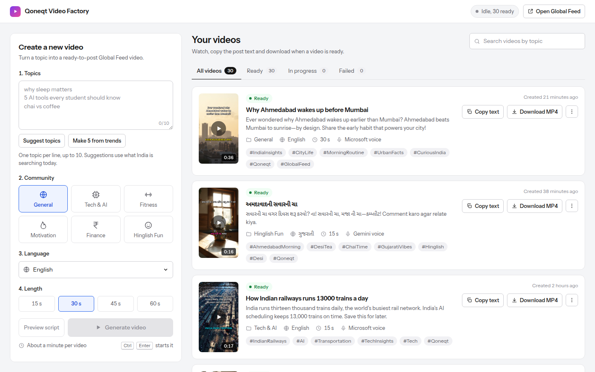
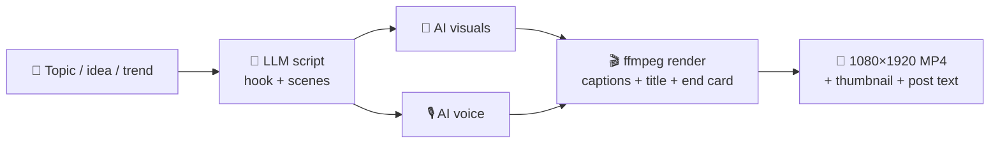
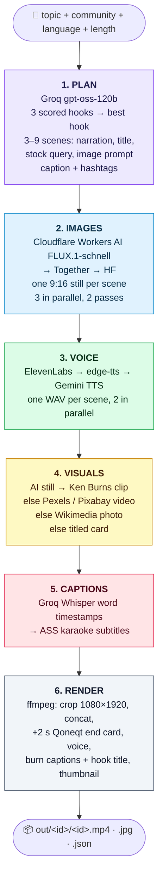
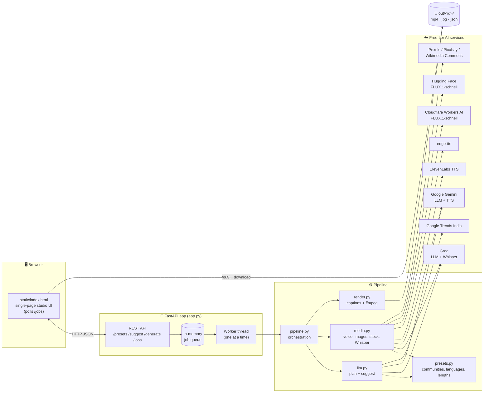
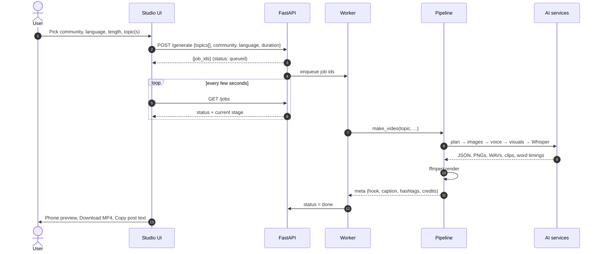
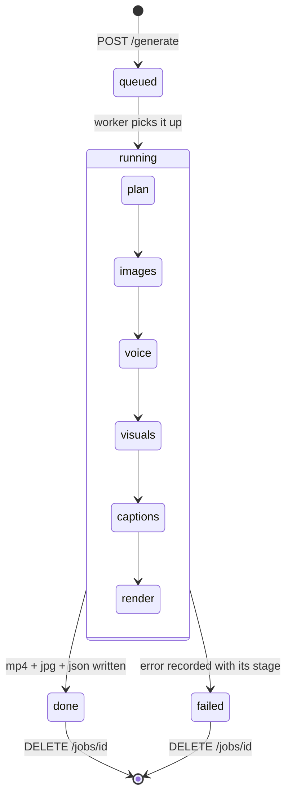
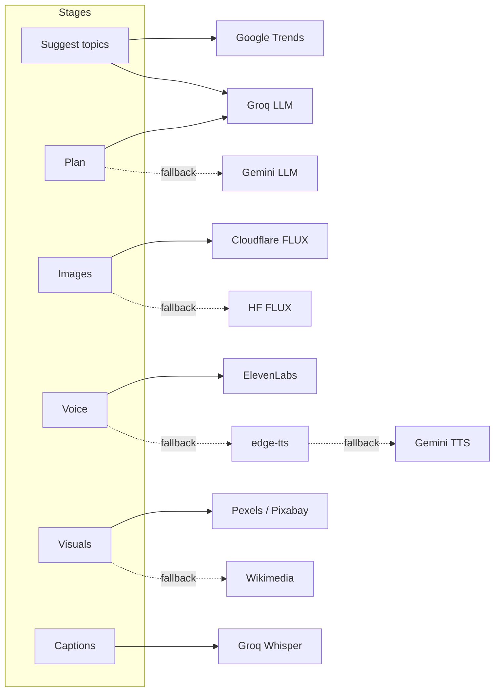
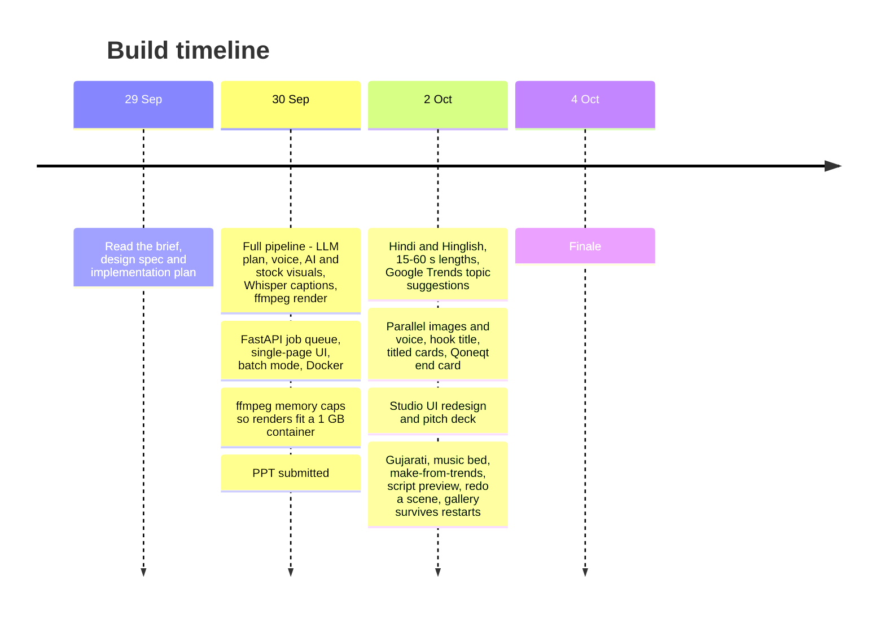
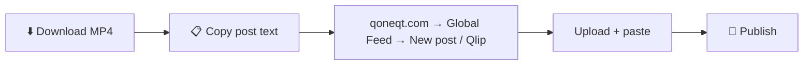

# 🎬 Qoneqt Video Factory

> **Topic in → publish-ready Qoneqt Global Feed short out.**
> An LLM-powered pipeline that turns a topic, idea or trend into a 9:16 vertical video with an AI script, AI voice,
> AI or stock visuals, word-by-word captions, a hook title, a music bed that ducks under the voice and a Qoneqt end
> card. It runs entirely on free tiers.

Built for **Qoneqt × CTRL FREAK 2026**, challenge: *"Build an LLM-Powered Content Pipeline for Qoneqt"*.

| | |
|---|---|
| 🌐 Live app | _coming soon_ |
| 🎥 Demo video | _coming soon_ |
| 📱 Published on Qoneqt | _coming soon_ |

<p align="center">
  
</p>

---

## 📌 Table of contents

1. [Problem statement](#-1-problem-statement)
2. [Our solution](#-2-our-solution)
3. [How it works (pipeline)](#-3-how-it-works-the-pipeline)
4. [Architecture](#-4-architecture)
5. [Tools, models and APIs](#-5-tools-models-and-apis)
6. [Reliability: fallback chains](#-6-reliability-fallback-chains)
7. [How we built it](#-7-how-we-built-it)
8. [Run it locally](#-8-run-it-locally)
9. [Deploy](#-9-deploy-hugging-face-spaces--docker)
10. [API reference](#-10-api-reference)
11. [Repo layout](#-11-repo-layout)
12. [Known limits](#-12-known-limits)

---

## 🎯 1. Problem statement

**Qoneqt** is a community-first social platform: people find communities, connect around shared interests, and
create and share content. Its **Global Feed** needs a steady flow of good short videos.

The challenge brief asks:

> *How can AI help create high-quality, engaging video content for the Qoneqt Global Feed **at scale**?*
> Build and deploy an AI-powered system that turns **a topic, prompt, idea or trend** into **engaging video
> content**. The goal is not a single generation. It is a **repeatable pipeline** that produces
> **publish-ready content at scale**.

What makes this hard:

| Pain point | Why it matters |
|---|---|
| ✍️ Writing a script with a strong hook | The first 2 seconds decide whether anyone keeps watching |
| 🎙️ Voice, visuals and captions | Each needs a different tool and a different skill |
| 🇮🇳 Indian audience | Content has to work in English, Hindi, Hinglish **and** Gujarati |
| 👥 Many communities | Tech, fitness, finance and others each need their own tone, hashtags and style |
| 🔁 Scale | Doing this by hand takes hours per video, so the feed can't keep up |
| 💸 Cost | Paid AI APIs add up quickly, so the whole thing has to run on free tiers |

---

## 💡 2. Our solution

**Qoneqt Video Factory** is a web app plus a pipeline. You pick a **community**, a **language** and a **length**,
then type a topic or let the app **suggest topics from what India is searching today**. A few minutes later you
get a finished vertical video, a thumbnail and ready-to-paste post text.



**Key features**

- 🧠 **Hook-first scripting**: the LLM writes 3 hooks, scores them, and builds the video on the best one
- 🌐 **4 languages**: English, हिन्दी (Devanagari), Hinglish (Roman script) and ગુજરાતી
- 👥 **6 community presets**: General, Tech & AI, Fitness & Health, Motivation, Money & Finance, Hinglish Fun
- ⏱️ **4 lengths**: 15 / 30 / 45 / 60 s; the scene count and word budget scale with the length
- 📈 **Trend-aware ideas**: Google Trends India → LLM → 6 topic ideas that fit the community, or **Make 5 from trends** in one click
- 👀 **Script preview**: see the 3 scored hooks and every scene before rendering, pick the opening line, then make the video
- 🎵 **Music bed**: a mood-matched track per community, ducked under the narration with `sidechaincompress`
- 🔁 **Redo a scene**: regenerate one scene's visual on a finished video and re-render in seconds
- 🗣️ **Word-pop karaoke captions**: each word lights up as it is spoken (Whisper word timestamps)
- 📦 **Batch mode**: queue up to 10 topics in one click
- 🛡️ **Fallbacks at every stage**: a flaky free API never kills a job
- 🧾 **Credits recorded**: every scene's image or stock source is stored in the job JSON
- 💰 **₹0 running cost**: every provider is on a free tier

<p align="center">
  
  
  
</p>

---

## ⚙️ 3. How it works (the pipeline)

Each video goes through **six stages**. The UI shows live progress for each stage.



### Stage by stage

| # | Stage | What happens | Output |
|---|---|---|---|
| 1 | **Plan** | The LLM returns strict JSON: 3 hooks with scores, scenes sized to the length (word budget = length × the language's measured speaking pace), caption and hashtags. The JSON is validated, and bad JSON gets one guided retry before the next model is tried. | `plan` dict |
| 2 | **Images** | One FLUX still per scene from that scene's `image_prompt`, 3 at a time. If every provider is down this stage is skipped and stage 4 uses stock. | `gen<i>.png` |
| 3 | **Voice** | Each scene's narration becomes speech. The voice is chosen by community (gender) and language, then normalised. | `voice<i>.wav`, `voice.wav` |
| 4 | **Visuals** | Each scene becomes a clip exactly as long as its voice line: a Ken Burns zoom on the AI still, else real stock footage, else a CC-licensed photo. | `clip<i>.mp4` |
| 5 | **Captions** | Whisper returns per-word timings. They become ASS karaoke lines with the active word in the community's accent colour. | `captions.ass` |
| 6 | **Render** | ffmpeg composes clips, the end card, voice, the ducked music bed, captions and the hook title into the final short, plus a thumbnail. | `<id>.mp4`, `<id>.jpg`, `<id>.json` |

---

## 🏗️ 4. Architecture

### System overview



### Request lifecycle



### Job states



---

## 🧰 5. Tools, models and APIs

### AI models and APIs

| Purpose | Primary | Fallback(s) | Key needed |
|---|---|---|---|
| 🧠 Script / plan / topic ideas | **Groq** `openai/gpt-oss-120b` | Groq `qwen/qwen3.8-27b` → **Gemini** `gemini-3.5-flash-lite` | `GROQ_API_KEY`, `GEMINI_API_KEY` |
| 📈 Trending topics | **Google Trends India** RSS | LLM-only ideas | none |
| 🎨 AI images | **Cloudflare Workers AI** FLUX.1-schnell | **Together AI** FLUX.1-schnell-Free → **Hugging Face** FLUX.1-schnell | `CF_ACCOUNT_ID` + `CF_API_TOKEN`; optional `TOGETHER_API_KEY`, `HF_TOKEN` |
| 🎙️ Voice | **ElevenLabs** `eleven_flash_v2_5` | **edge-tts** (Indian neural voices) → **Gemini TTS** | `ELEVENLABS_API_KEY` (optional) |
| 🎞️ Stock visuals | **Pexels** video | **Pixabay** video → **Wikimedia Commons** photos | Pexels / Pixabay optional; Commons needs none |
| 🗣️ Word timestamps | **Groq Whisper** `whisper-large-v3-turbo` | script words spread evenly over each scene | `GROQ_API_KEY` |

### Engineering stack

| Layer | Tool |
|---|---|
| Backend | **Python 3.11**, **FastAPI**, **Uvicorn** |
| HTTP | **httpx** |
| Video / audio | **ffmpeg** (concat, cover-crop, Ken Burns zoom, libass subtitle burn-in, thumbnail) |
| Captions | **ASS** subtitle format with karaoke tags, **Noto** fonts (Latin, Devanagari, Gujarati) |
| Music | 4 tracks by Kevin MacLeod (incompetech.com, CC BY 4.0) in `assets/music/`, 75 s, mono 64 kbps |
| Frontend | One `static/index.html`: plain HTML, CSS and JS, no build step |
| Tests | **pytest** (45 unit tests) |
| Container | **Docker** (`python:3.11-slim` + ffmpeg + fonts) |
| Hosting | **Hugging Face Spaces** (Docker, free CPU) |

### Where each provider is used



---

## 🛡️ 6. Reliability: fallback chains

Free APIs fail often (rate limits, 500s, quota). Every stage therefore has a chain, and a failure moves on to the
next provider instead of failing the job.

```mermaid
flowchart TD
    subgraph LLM["🧠 Script"]
        L1[Groq gpt-oss-120b] -->|fail| L2[Groq qwen3.8-27b] -->|fail| L3[Gemini flash-lite] -->|fail| LX[❌ job fails]
    end
    subgraph IMG["🎨 Image"]
        I1[Cloudflare FLUX] -->|fail| I2[Together / HF FLUX.1-schnell] -->|fail| I3[retry both once] -->|fail| IX[➡️ use stock]
    end
    subgraph TTS["🎙️ Voice"]
        T1[ElevenLabs] -->|fail / quota| T2[edge-tts] -->|fail| T3[Gemini TTS]
    end
    subgraph VIS["🎞️ Visual"]
        V1[AI still] -->|none| V2[Pexels] -->|fail| V3[Pixabay] -->|fail| V4[Wikimedia ×2] -->|fail| V5[Titled card]
    end
```



Other safety nets:

- **JSON validation + guided retry**: a plan with the wrong scene count, wrong word budget or missing keys is sent back to the model once with the exact problem.
- **Provider cooldown**: an image provider that returns 401/402/403 is rested, so later scenes don't keep hitting it.
- **Bounded parallelism**: images 3 at a time, voices 2 at a time (the ElevenLabs free-tier limit), ffmpeg sequential so it fits a 2 vCPU / 1 GB container.
- **Isolated worker**: one bad job is marked `failed` with its stage and the worker moves on.

---

## 🛠️ 7. How we built it



Design principles we followed:

1. **CLI first, UI second**: `python pipeline.py "topic"` produced a full video before any web code existed.
2. **Pure logic is unit-tested**: plan validation, word budgets, caption timing and ASS generation have tests; network calls do not.
3. **Config is data**: a new community or language is one dict entry in `presets.py`.
4. **One knob for format**: `W, H` in `render.py` switches 9:16 to square.
5. **Zero cost**: every service is on a free tier, with a no-key path (edge-tts + Wikimedia) so the app still works when keys run out.

### Adding a community or language

```python
# presets.py
COMMUNITIES["travel"] = dict(
    label="Travel", tone="...", language="en", caption_style="...",
    hashtags=["#Qoneqt", "#Travel"], voice_eleven="<voice id>", voice_gemini="Kore",
    gender="f", mood="calm", accent="00E5FF",
)
```

---

## 🚀 8. Run it locally

### Prerequisites

- Python **3.11+**
- **ffmpeg** on your `PATH` (`sudo apt install ffmpeg fonts-noto-core` / `brew install ffmpeg`)
- Free API keys (see the table below). Only **Groq** is really required; everything else has a fallback.

### Steps

```bash
# 1. Clone
git clone https://github.com/darshit001/hackthn.git
cd hackthn

# 2. Virtual env + dependencies
python3 -m venv .venv && . .venv/bin/activate
pip install -r requirements.txt

# 3. Keys
cp .env.example .env        # then fill in the keys you have

# 4. Start the web app
uvicorn app:app --reload --port 7860
# → open http://localhost:7860
```

### Useful commands

```bash
python pipeline.py "why sleep matters" tech en 30    # one video end-to-end → out/<id>/<id>.mp4
python llm.py suggest tech hi                        # topic ideas for a community + language
python -m pytest -q                                  # 45 unit tests
```

### Environment variables

| Variable | Where to get it (free) | Required? |
|---|---|---|
| `GROQ_API_KEY` | [console.groq.com](https://console.groq.com) | ✅ yes (LLM + Whisper) |
| `GEMINI_API_KEY` | [aistudio.google.com](https://aistudio.google.com) | recommended (LLM / TTS fallback) |
| `ELEVENLABS_API_KEY` | [elevenlabs.io](https://elevenlabs.io) | optional (best voice; edge-tts otherwise) |
| `TOGETHER_API_KEY` | [api.together.ai](https://api.together.ai) (free FLUX.1-schnell tier) | optional (image fallback) |
| `CF_ACCOUNT_ID`, `CF_API_TOKEN` | [dash.cloudflare.com](https://dash.cloudflare.com) → Workers AI → Use REST API (free 10k neurons/day) | recommended (AI images) |
| `HF_TOKEN` | [huggingface.co/settings/tokens](https://huggingface.co/settings/tokens), enable *"Make calls to Inference Providers"* | optional (image fallback) |
| `PEXELS_API_KEY` | [pexels.com/api](https://www.pexels.com/api/) | optional (stock video) |
| `PIXABAY_API_KEY` | [pixabay.com/api/docs](https://pixabay.com/api/docs/) | optional (stock video) |

### Run with Docker

```bash
docker build -t qoneqt-video-factory .
docker run --env-file .env -p 7860:7860 qoneqt-video-factory
```

---

## ☁️ 9. Deploy (Hugging Face Spaces / Docker)

1. Create a Space: **SDK = Docker**, hardware = **CPU basic (free)**.
2. **Settings → Variables and secrets**: add the keys from the table above.
3. Push:
   ```bash
   git remote add hf https://huggingface.co/spaces/<user>/<space>
   git push hf main
   ```
4. Open the Space URL. `out/` is ephemeral on the free tier, so download the videos you want to keep.

### Publishing to Qoneqt

Qoneqt has no public posting API, so the last step is manual:



---

## 📡 10. API reference

| Method | Path | Body / query | Returns |
|---|---|---|---|
| `GET` | `/` | | Studio UI |
| `GET` | `/presets` | | communities, languages, durations |
| `GET` | `/suggest` | `?community=tech&language=hi&trends_only=1` | 6 topic ideas (trend-aware; `trends_only` makes them all trend-led) |
| `POST` | `/plan` | `{"topic": "...", "community": "tech", "language": "en", "duration": 30}` | the script: scored hooks, scenes, caption, hashtags |
| `POST` | `/generate` | `{"topics": ["..."], "community": "tech", "language": "en", "duration": 30, "plan": {...}}` (1–10 topics; `plan` optional, from `/plan`) | `{"job_ids": [...]}` |
| `POST` | `/jobs/{id}/redo/{scene}` | | regenerates that scene's visual and re-renders |
| `GET` | `/jobs` | | every job with status and stage |
| `GET` | `/jobs/{id}` | | one job + result meta |
| `DELETE` | `/jobs/{id}` | | removes the job and its files |
| `GET` | `/out/{id}/{id}.mp4` | | the video (also `.jpg`, `.json`) |

Example:

```bash
curl -X POST localhost:7860/generate -H 'content-type: application/json' \
  -d '{"topics":["UPI tips nobody tells you"],"community":"finance","language":"hinglish","duration":30}'
```

---

## 🗂️ 11. Repo layout

```
.
├── app.py             FastAPI app, job queue, worker thread, REST API
├── pipeline.py        orchestrates the 6 stages + CLI smoke test
├── llm.py             plan + topic suggestions, Google Trends, JSON validation, Groq → Gemini chain
├── media.py           TTS chain, AI image chain, stock clip chain, Whisper word timings
├── render.py          ASS karaoke captions, hook/title overlays, end card, ffmpeg compose
├── presets.py         communities, languages, durations, music moods
├── assets/music/      4 CC BY tracks (Kevin MacLeod)
├── static/index.html  single-page studio UI
├── tests/             pytest unit tests (plan validation, captions, render, API)
├── docs/              challenge brief, deck, design specs, screenshots
├── Dockerfile         python:3.11-slim + ffmpeg + Noto fonts
└── requirements.txt
```

---

## ⚠️ 12. Known limits

| Limit | Why | Upgrade path |
|---|---|---|
| Job *state* is in memory; finished videos are rebuilt from `out/*/*.json` at startup | Simple and enough for a demo | Redis / SQLite for queue state |
| `out/` is ephemeral on free hosting | Free hosting | Mount a volume at `/app/out` (Railway) or object storage |
| One worker | 2 vCPU / 1 GB container; ffmpeg is the bottleneck | More workers on bigger hardware |
| ElevenLabs free tier ≈ 20 videos / month | Free quota | edge-tts takes over automatically |
| Manual publish to Qoneqt | No public posting API | Direct upload once an API exists |

---

<p align="center">Made with ☕ for <b>Qoneqt × CTRL FREAK 2026</b></p>
