<p align="center">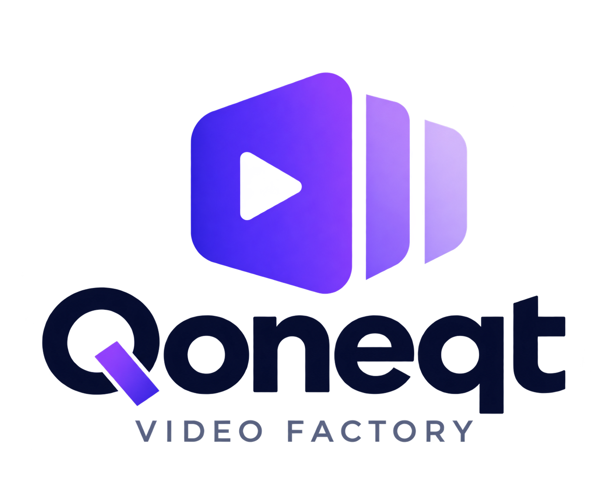</p>

# Qoneqt Video Factory

> **Topic in → publish-ready Qoneqt Global Feed short out.**
> An LLM-powered pipeline that turns a topic, idea or trend into a 9:16 vertical video with an AI script, AI voice,
> AI or stock visuals, word-by-word captions, a hook title, a music bed that ducks under the voice and a Qoneqt end
> card. Add your photo and **you** present it, talking. The same topic can also become a 4:5 image post or a
> 2–4 slide carousel. It runs entirely on free tiers.

Built for **Qoneqt × CTRL FREAK 2026**, challenge: *"Build an LLM-Powered Content Pipeline for Qoneqt"*.

| | |
|---|---|
| 🌐 Live app | https://qoneqt-video-factory-ai.up.railway.app/ |
| 🎥 Demo video | https://canva.link/104yrj69lmkva1x |
| 📱 Published on Qoneqt | _coming soon_ |

<p align="center">
  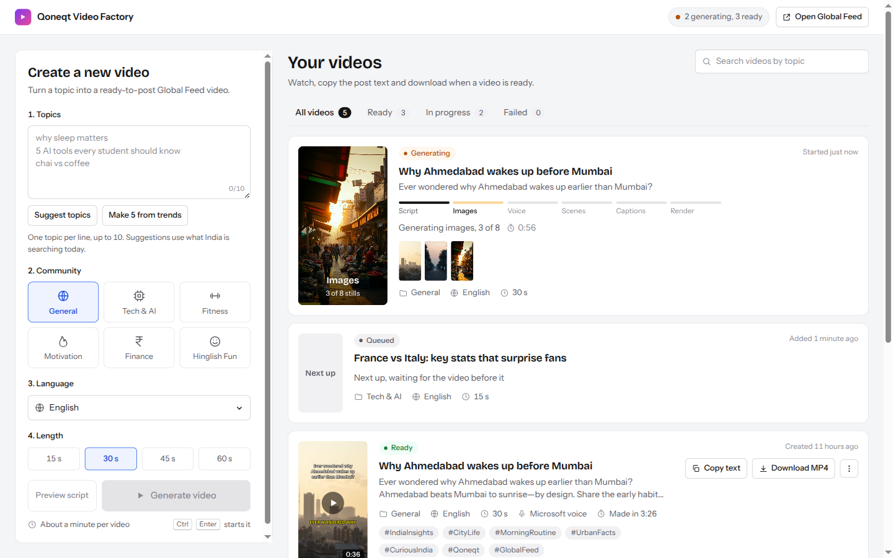
</p>

---

## 📌 Table of contents

1. [Problem statement](#-1-problem-statement)
2. [Our solution](#-2-our-solution)
3. [How it works (pipeline)](#-3-how-it-works-the-pipeline)
4. [Architecture](#-4-architecture)
5. [Tools, models and APIs](#-5-tools-models-and-apis)
6. [Reliability: fallback chains](#-6-reliability-fallback-chains)
7. [How we built it](#-7-how-we-built-it)
8. [Run it locally](#-8-run-it-locally)
9. [Deploy](#-9-deploy-hugging-face-spaces--docker)
10. [API reference](#-10-api-reference)
11. [Repo layout](#-11-repo-layout)
12. [Known limits](#-12-known-limits)

---

## 🎯 1. Problem statement

**Qoneqt** is a community-first social platform: people find communities, connect around shared interests, and
create and share content. Its **Global Feed** needs a steady flow of good short videos.

The challenge brief asks:

> *How can AI help create high-quality, engaging video content for the Qoneqt Global Feed **at scale**?*
> Build and deploy an AI-powered system that turns **a topic, prompt, idea or trend** into **engaging video
> content**. The goal is not a single generation. It is a **repeatable pipeline** that produces
> **publish-ready content at scale**.

What makes this hard:

| Pain point | Why it matters |
|---|---|
| ✍️ Writing a script with a strong hook | The first 2 seconds decide whether anyone keeps watching |
| 🎙️ Voice, visuals and captions | Each needs a different tool and a different skill |
| 🇮🇳 Indian audience | Content has to work in English, Hindi, Hinglish **and** Gujarati |
| 👥 Many communities | Tech, fitness, finance and others each need their own tone, hashtags and style |
| 🔁 Scale | Doing this by hand takes hours per video, so the feed can't keep up |
| 💸 Cost | Paid AI APIs add up quickly, so the whole thing has to run on free tiers |

---

## 💡 2. Our solution

**Qoneqt Video Factory** is a web app plus a pipeline. You pick **Video** or **Image**, a **community**, a
**language** and a **length**, then type a topic or let the app **suggest topics from what India is searching
today**. A few minutes later you get a finished vertical video (or a picture post), a thumbnail and ready-to-paste
post text, all in a library you can search, filter, save and download from.

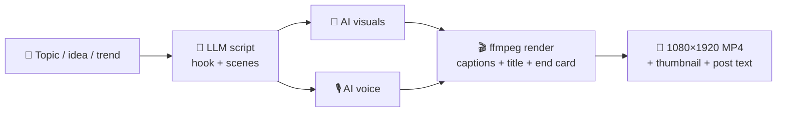

**Key features**

- 🧠 **Hook formulas**: 3 openers (question, bold claim, number, myth, story, warning), each scored with a one-line "why it works"; the video is built on the best
- 🎬 **Retention beats**: hook → context → rehook → twist → payoff; openers like "Did you know" are rejected by the validator before anything is rendered
- ✂️ **Crossfades and mid-scene cuts**: scenes crossfade into each other and the end card; scenes over 4 s cut between two AI shots halfway through the sentence
- 📷 **A different shot per scene**: wide, close-up, portrait, action, aftermath, so AI stills never look alike
- 📋 **Post text for three platforms**: Qoneqt caption, YouTube Shorts title + description, Instagram caption
- 🙋 **You in the video**: upload a photo (with a consent tick) and pick an outfit; FLUX.2 klein restyles it (same face, better clothes and light) on a button press. The first and last scenes are that portrait **talking** (LeapTalk → MoDA on free Hugging Face ZeroGPU Spaces), and the middle scenes are AI pictures with you in them
- 🖼️ **Image posts and carousels**: one 4:5 picture with its headline, or 2–4 slides whose texts read as one story, each with a page mark; caption, hashtags and alt text included, and the last slide points readers to the caption. Bring your own pictures, or have AI redraw them in the chosen look
- 📚 **Your library**: a grid of tiles with search (hook, caption, hashtags), Filter by type, community, language, look and length, sort, an Instagram-style **Saved** tab, and a watch view with Post, Details, Script (redo any scene) and More videos
- 📦 **Download as ZIP**: video, cover JPG and post text in one file, straight from a tile
- ⏹️ **Stop and confirm**: stop a video mid-make; deleting or stopping asks first, with the thumbnail
- 🌍 **One topic, every language** (API: `all_languages`): the video is also made in the other three languages; those versions translate the script (keeping your chosen hook) and reuse the first video's stills, so they cost no image quota and finish faster
- 🎨 **Four looks**: Photo, Anime, Infographic or Cinematic stills, picked in the form
- 🛡️ **Safety and claim review**: an editor pass softens unverifiable or medical/financial certainty and blocks unsafe scripts before a single image or voice line is spent; the card says "Brand-safe" or how many lines were softened
- ✏️ **Editable script**: every title and narration line in the preview can be edited, with a live word count, before generating
- ⚡ **Voice records while the images generate**: a 15 s video in about 45 s
- 🌐 **4 languages**: English, हिन्दी (Devanagari), Hinglish (Roman script) and ગુજરાતી
- 👥 **6 community presets**: General, Tech & AI, Fitness & Health, Motivation, Money & Finance, Hinglish Fun
- ⏱️ **4 lengths**: 15 / 30 / 45 / 60 s; the scene count and word budget scale with the length
- 📈 **Trend-aware ideas**: Google Trends India → LLM → 6 topic ideas that fit the community
- 👀 **Script preview**: see the 3 scored hooks and every scene before rendering, pick the opening line, then make the video
- 🎵 **Music bed**: a mood-matched track per community, ducked under the narration with `sidechaincompress`
- 🔁 **Redo a scene**: regenerate one scene's visual on a finished video and re-render in under a minute
- 🗣️ **Word-pop karaoke captions**: each word lights up as it is spoken (Whisper per scene, with the script as its prompt)
- 📦 **Batch mode**: queue up to 10 topics in one click
- 🛡️ **Fallbacks at every stage**: a flaky free API never kills a job
- 🧾 **Credits recorded**: every scene's image or stock source is stored in the job JSON
- 💰 **₹0 running cost**: every provider is on a free tier

<p align="center">
  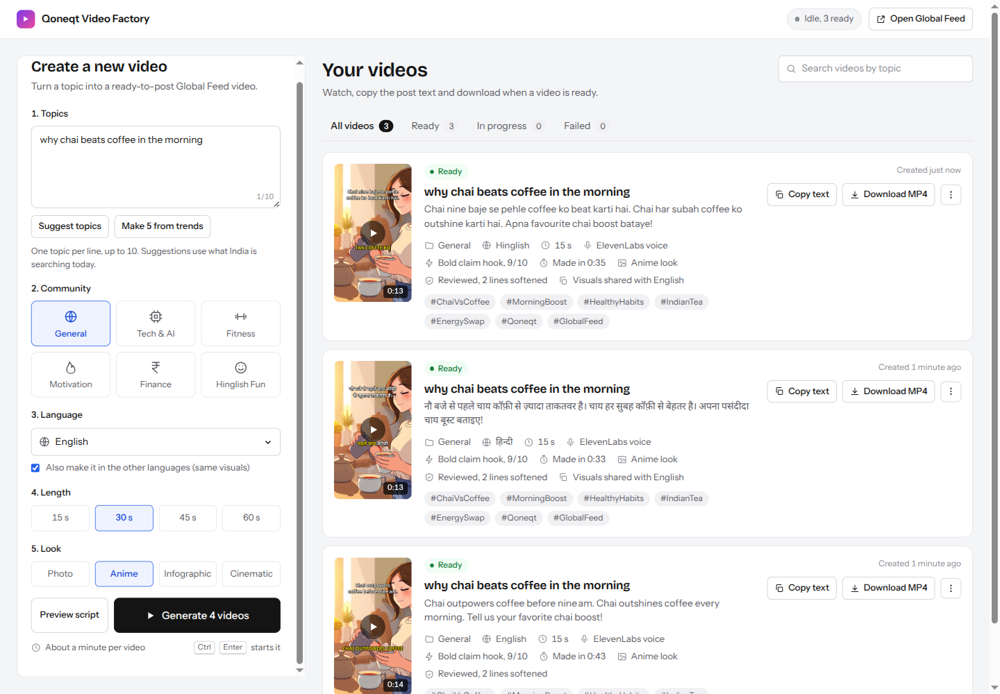
  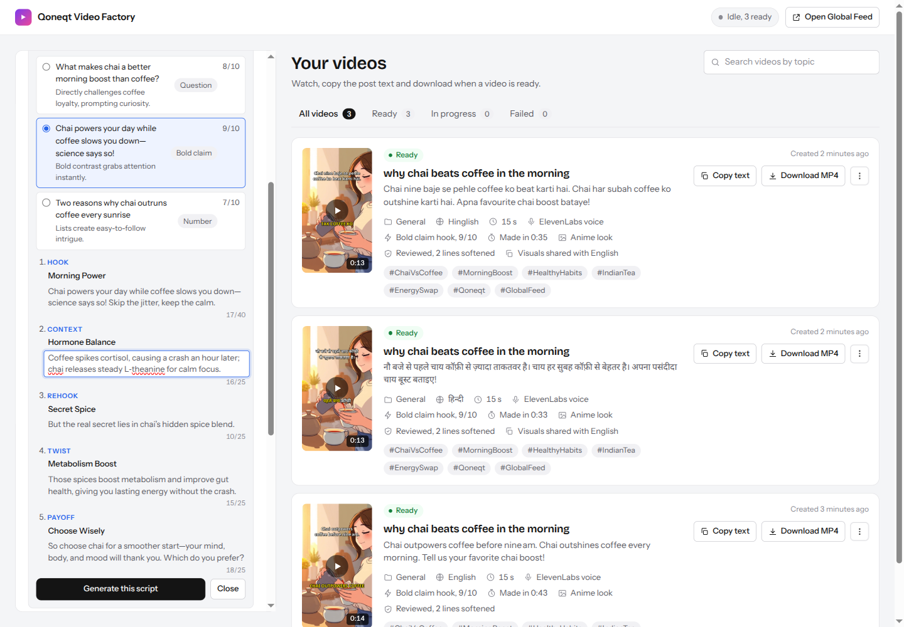
</p>

<p align="center">
  
  
  
</p>

---

## ⚙️ 3. How it works (the pipeline)

Each video goes through **six stages**. The UI shows live progress for each stage.

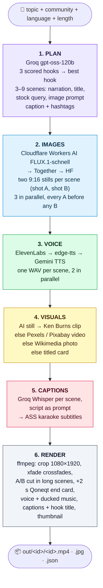

### Stage by stage

| # | Stage | What happens | Output |
|---|---|---|---|
| 1 | **Plan** | The LLM returns strict JSON: three hooks, each with a formula, a score and a one-line why; scenes sized to the length (word budget = length × the language's measured speaking pace), each with a beat and two image prompts from different shots; the Qoneqt caption and hashtags; YouTube and Instagram post text. The JSON is validated (banned openers, beat order, every field), and a bad plan gets one guided retry before the next model is tried. A safety and claim review then softens or blocks the script. A version in another language translates the source video's plan instead: beats, visuals and hashtags are copied, only the words change, and the text must be in the target script. | `plan` dict |
| 2 | **Images** | Two FLUX stills per scene (`image_prompt`, then `image_prompt_b`), 3 at a time, every scene's first picture before any second one. The look (photo, anime, infographic, cinematic) leads every prompt. The voice lines record in parallel. A version in another language copies the source's stills instead. If every provider is down this stage is skipped and stage 4 uses stock. | `gen<i>.png` |
| 3 | **Voice** | Each scene's narration becomes speech. The voice is chosen by community (gender) and language, then normalised. | `voice<i>.wav`, `voice.wav` |
| 4 | **Visuals** | Each scene becomes a clip as long as its voice line plus a 0.35 s tail for the crossfade: a Ken Burns zoom on the AI still, else real stock footage, else a CC-licensed photo. Scenes of 4 s or more cut from shot A to shot B halfway. | `clip<i>.mp4` |
| 5 | **Captions** | Whisper runs once per scene with that scene's narration as its prompt, so timings land on the right words. They become ASS karaoke lines with the active word in the community's accent colour. | `captions.ass` |
| 6 | **Render** | ffmpeg crossfades the clips into each other and the end card, mixes voice and the ducked music bed, burns captions and the hook title, and writes the thumbnail. | `<id>.mp4`, `<id>.jpg`, `<id>.json` |

### With your photo ("You, talking")

The photo is cropped and, if you press **Restyle with AI**, redrawn by FLUX.2 klein 4B on Cloudflare (512×1024,
~57 neurons, about the price of a FLUX.1 still). Scene 1 and the last scene are the head square talking (LeapTalk,
then MoDA), laid back onto the portrait with a feathered edge so the outfit stays; the hook title moves to the
chest. Middle scenes are FLUX.2 pictures with the portrait as reference. Every Space or FLUX.2 failure falls back
to a still portrait or a plain picture, so the video still finishes. Hands and body stay still: no free model
animates a whole body.

### Image posts

`plan → image → poster` on its own queue and worker, so a picture never waits behind a video render (~10 s each).
The LLM writes the headline, slide texts, caption, hashtags and alt text; the same safety review runs over every
line. FLUX draws each slide (3 at a time, every prompt led by one shared look) unless you uploaded your own;
ffmpeg cover-crops to 1080×1350 and burns the headline, page mark, Qoneqt mark and call to action with libass.
A carousel also gets `<id>.zip`. Any slide can be redrawn alone.

---

## 🏗️ 4. Architecture

### System overview

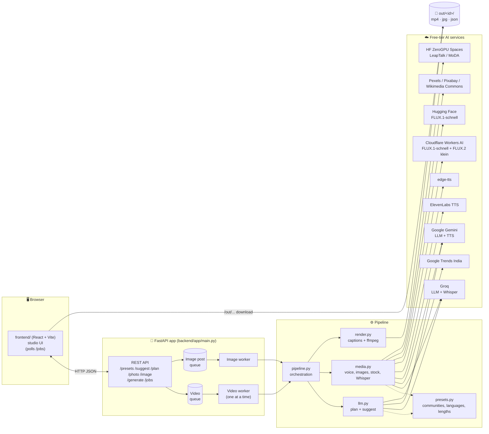

### Request lifecycle

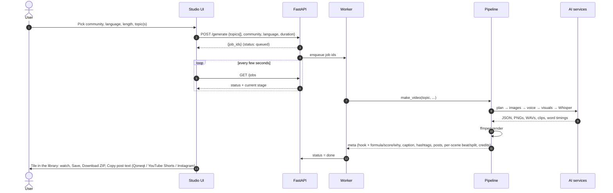

### Job states

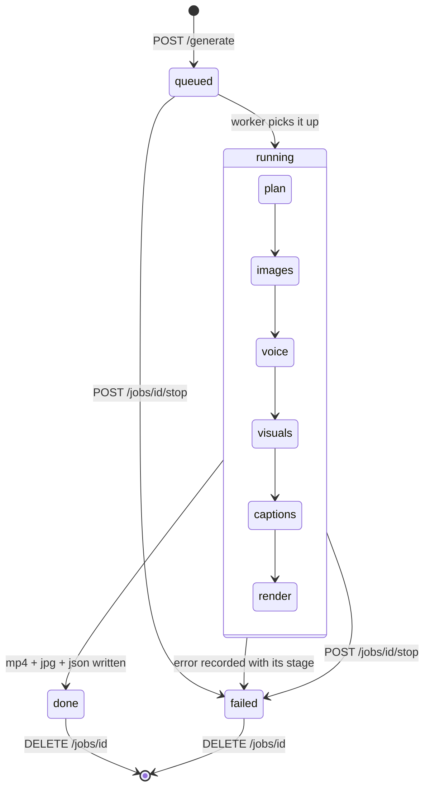

---

## 🧰 5. Tools, models and APIs

### AI models and APIs

| Purpose | Primary | Fallback(s) | Key needed |
|---|---|---|---|
| 🧠 Script / plan / topic ideas | **Groq** `openai/gpt-oss-120b` | Groq `qwen/qwen3.8-27b` → **Gemini** `gemini-3.5-flash-lite` | `GROQ_API_KEY`, `GEMINI_API_KEY` |
| 📈 Trending topics | **Google Trends India** RSS | LLM-only ideas | none |
| 🎨 AI images | **Cloudflare Workers AI** FLUX.1-schnell | **Together AI** FLUX.1-schnell-Free → **Hugging Face** FLUX.1-schnell | `CF_ACCOUNT_ID` + `CF_API_TOKEN`; optional `TOGETHER_API_KEY`, `HF_TOKEN` |
| 🙋 Restyled photo, you in a scene | **Cloudflare Workers AI** FLUX.2 klein 4B (512×1024) | still portrait / plain FLUX.1 picture | `CF_ACCOUNT_ID` + `CF_API_TOKEN` |
| 🗣️ Talking face | **LeapTalk** (`hugging-apps/leaptalk-talking-head`) via `gradio_client` | **MoDA** (`multimodalart/MoDA-fast-talking-head`) → Ken Burns on the still photo | `HF_TOKEN` (ZeroGPU quota) |
| 🎙️ Voice | **ElevenLabs** `eleven_flash_v2_5` | **edge-tts** (Indian neural voices) → **Gemini TTS** | `ELEVENLABS_API_KEY` (optional) |
| 🎞️ Stock visuals | **Pexels** video | **Pixabay** video → **Wikimedia Commons** photos | Pexels / Pixabay optional; Commons needs none |
| 🗣️ Word timestamps | **Groq Whisper** `whisper-large-v3-turbo` | script words spread evenly over each scene | `GROQ_API_KEY` |

### Engineering stack

| Layer | Tool |
|---|---|
| Backend | **Python 3.11**, **FastAPI**, **Uvicorn** |
| HTTP | **httpx**, **gradio_client** (ZeroGPU Spaces) |
| Video / audio | **ffmpeg 5.1** (xfade crossfades, cover-crop, Ken Burns zoom, libass subtitle burn-in, posters, thumbnail) |
| Captions | **ASS** subtitle format with karaoke tags, **Noto** fonts (Latin, Devanagari, Gujarati) |
| Music | 4 tracks by Kevin MacLeod (incompetech.com, CC BY 4.0) in `backend/assets/music/`, 75 s, mono 64 kbps |
| Frontend | **React 19** + **Vite** in `frontend/`, plain CSS; built into `frontend/dist` and served by FastAPI |
| Tests | **pytest** (137 tests) + `node --test` for the library search, filter and sort |
| Container | **Docker**, two stages: `node:22-slim` builds the UI, `python:3.11-slim-bookworm` + ffmpeg 5.1 + fonts runs it |
| Hosting | **Railway** or **Hugging Face Spaces** (Docker, 1 GB box) |

### Where each provider is used

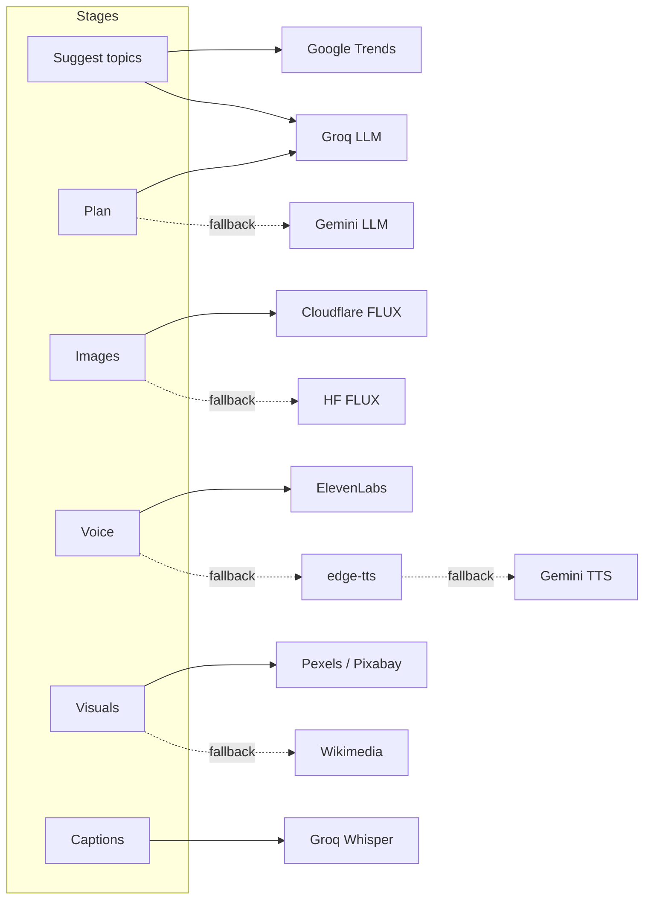

---

## 🛡️ 6. Reliability: fallback chains

Free APIs fail often (rate limits, 500s, quota). Every stage therefore has a chain, and a failure moves on to the
next provider instead of failing the job.

```mermaid
flowchart TD
    subgraph LLM["🧠 Script"]
        L1[Groq gpt-oss-120b] -->|fail| L2[Groq qwen3.8-27b] -->|fail| L3[Gemini flash-lite] -->|fail| LX[❌ job fails]
    end
    subgraph IMG["🎨 Image"]
        I1[Cloudflare FLUX] -->|fail| I2[Together / HF FLUX.1-schnell] -->|fail| I3[retry both once] -->|fail| IX[➡️ use stock]
    end
    subgraph TTS["🎙️ Voice"]
        T1[ElevenLabs] -->|fail / quota| T2[edge-tts] -->|fail| T3[Gemini TTS]
    end
    subgraph VIS["🎞️ Visual"]
        V1[AI still] -->|none| V2[Pexels] -->|fail| V3[Pixabay] -->|fail| V4[Wikimedia ×2] -->|fail| V5[Titled card]
    end
    subgraph FACE["🗣️ Talking face"]
        F1[LeapTalk] -->|fail / quota| F2[MoDA] -->|fail| F3[Ken Burns on the still portrait]
    end
```

Other safety nets:

- **JSON validation + guided retry**: a plan with the wrong scene count, wrong word budget or missing keys is sent back to the model once with the exact problem.
- **Key rotation**: every keyed provider tries `KEY`, then `KEY_2`, `KEY_3`, `KEY_4`; a key rejected for auth or quota moves to the next one before the provider chain falls back.
- **Provider cooldown**: an image provider that returns 401/402/403 is rested, and a Space out of quota is skipped for a while, so later scenes don't keep hitting them.
- **Plain quota messages**: when every Cloudflare account has spent its daily neurons, the form says so and that it resets at 05:30 IST; your own photo or picture still works meanwhile.
- **Bounded parallelism**: images 3 at a time, voices 2 at a time (the ElevenLabs free-tier limit), ffmpeg sequential on ffmpeg 5.1 (a 30 s render peaks at ~530 MB; ffmpeg 7 hit 930 MB and was OOM-killed in a 1 GB box).
- **Isolated workers**: one bad job is marked `failed` with its stage and the worker moves on; image posts have their own worker.

---

## 🛠️ 7. How we built it

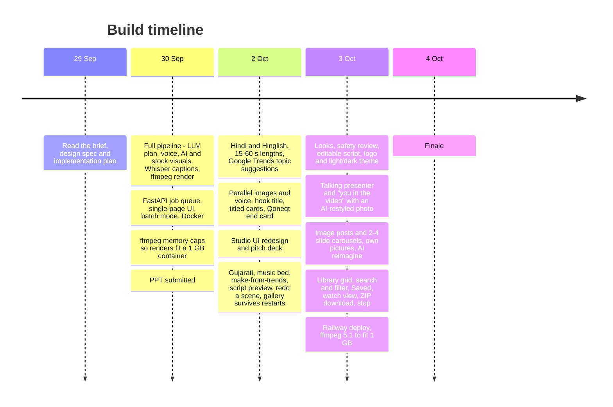

Design principles we followed:

1. **CLI first, UI second**: `python pipeline.py "topic"` produced a full video before any web code existed.
2. **Pure logic is unit-tested**: plan validation, word budgets, caption timing and ASS generation have tests; network calls do not.
3. **Config is data**: a new community or language is one dict entry in `presets.py`.
4. **One knob for format**: `W, H` in `render.py` switches 9:16 to square.
5. **Zero cost**: every service is on a free tier, with a no-key path (edge-tts + Wikimedia) so the app still works when keys run out.

### Adding a community or language

```python
# presets.py
COMMUNITIES["travel"] = dict(
    label="Travel", tone="...", language="en", caption_style="...",
    hashtags=["#Qoneqt", "#Travel"], voice_eleven="<voice id>", voice_gemini="Kore",
    gender="f", mood="calm", accent="00E5FF",
)
```

---

## 🚀 8. Run it locally

### Prerequisites

- Python **3.11+** and **Node 20+**
- **ffmpeg** on your `PATH` (`sudo apt install ffmpeg fonts-noto-core` / `brew install ffmpeg`)
- Free API keys (see the table below). Only **Groq** is really required; everything else has a fallback.

### Steps

```bash
# 1. Clone
git clone https://github.com/darshit001/hackthn.git
cd hackthn

# 2. Backend: virtual env + dependencies + keys
cd backend
python3 -m venv .venv && . .venv/bin/activate
pip install -r requirements.txt
cp .env.example .env        # then fill in the keys you have

# 3. Frontend: build the UI once
cd ../frontend && npm install && npm run build

# 4. Start the web app (serves the API and the built UI)
cd ../backend && uvicorn app.main:app --reload --port 9000
# → open http://localhost:9000
```

Working on the UI? Keep the backend running on port 9000 (step 4) and run `npm run dev` in `frontend/`,
then open http://localhost:8000. Vite reloads on save and proxies every API call to :9000. To show it to someone
else, run `ngrok http 8000` (the public URL changes each time ngrok restarts).

### Useful commands

Run these from `backend/`:

```bash
python -m app.pipeline "why sleep matters" tech en 30   # one video end-to-end → out/<id>/<id>.mp4
python -m app.llm suggest tech hi                       # topic ideas for a community + language
python -m pytest -q                                     # 137 tests
```

And from `frontend/`: `node --test src/lib/library.test.js` (library search, filter, sort, related videos).

### Environment variables

| Variable | Where to get it (free) | Required? |
|---|---|---|
| `GROQ_API_KEY` | [console.groq.com](https://console.groq.com) | ✅ yes (LLM + Whisper) |
| `GEMINI_API_KEY` | [aistudio.google.com](https://aistudio.google.com) | recommended (LLM / TTS fallback) |
| `ELEVENLABS_API_KEY` | [elevenlabs.io](https://elevenlabs.io) | optional (best voice; edge-tts otherwise) |
| `TOGETHER_API_KEY` | [api.together.ai](https://api.together.ai) (free FLUX.1-schnell tier) | optional (image fallback) |
| `CF_ACCOUNT_ID`, `CF_API_TOKEN` | [dash.cloudflare.com](https://dash.cloudflare.com) → Workers AI → Use REST API (free 10k neurons/day) | recommended (AI images, photo restyle, you in the scenes) |
| `HF_TOKEN` | [huggingface.co/settings/tokens](https://huggingface.co/settings/tokens), enable *"Make calls to Inference Providers"* | optional (image fallback; ZeroGPU quota for the talking face) |
| `PEXELS_API_KEY` | [pexels.com/api](https://www.pexels.com/api/) | optional (stock video) |
| `PIXABAY_API_KEY` | [pixabay.com/api/docs](https://pixabay.com/api/docs/) | optional (stock video) |

**Spare keys.** Up to three more accounts can back any of the keyed providers: add `_2`, `_3` and `_4` to the
name (`GROQ_API_KEY_2`, `ELEVENLABS_API_KEY_3`, `CF_ACCOUNT_ID_2` + `CF_API_TOKEN_2`, …; `HF_TOKEN` goes up to
`_3`). When a key is rejected or out of quota the next one is tried straight away, before the provider chain gives
up and falls back. Handy on free tiers: ElevenLabs allows 10k characters a month per account, so each spare key
adds to the good-voice budget. Cloudflare's two variables rotate as a pair, so set both halves of a suffix
together or that set is ignored.

### Run with Docker

```bash
docker build -t qoneqt-video-factory .
docker run --env-file backend/.env -p 7860:7860 qoneqt-video-factory
```

---

## ☁️ 9. Deploy (Railway / Hugging Face Spaces / Docker)

The `Dockerfile` serves everything on port 7860. It pins `python:3.11-slim-bookworm` on purpose: ffmpeg 5.1 keeps
a 30 s render near 530 MB, so it fits a 1 GB box.

**Railway**: new project from the GitHub repo, it builds the `Dockerfile`; add the keys under Variables and mount a
volume at `/app/backend/out` so videos survive redeploys.

**Hugging Face Spaces**:

1. Create a Space: **SDK = Docker**, hardware = **CPU basic (free)**.
2. **Settings → Variables and secrets**: add the keys from the table above.
3. Push:
   ```bash
   git remote add hf https://huggingface.co/spaces/<user>/<space>
   git push hf main
   ```
4. Open the Space URL. `backend/out/` is ephemeral on the free tier, so download the videos you want to keep.

### Publishing to Qoneqt

Qoneqt has no public posting API, so the last step is manual:

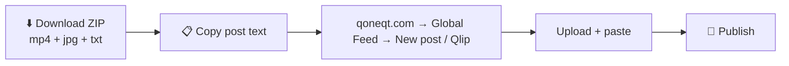

---

## 📡 10. API reference

| Method | Path | Body / query | Returns |
|---|---|---|---|
| `GET` | `/` | | Studio UI |
| `GET` | `/presets` | | communities (accent colour, examples), languages, durations, looks, outfits (+ the default per community), layouts |
| `GET` | `/suggest` | `?community=tech&language=hi&trends_only=1` | 6 topic ideas (trend-aware; `trends_only` makes them all trend-led) |
| `POST` | `/plan` | `{"topic": "...", "community": "tech", "language": "en", "duration": 30}` | the script: scored hooks with formula and why, scenes with beats, caption, hashtags, YouTube and Instagram post text |
| `POST` | `/photo/restyle` | `{"photo": "data:image/...", "outfit": "smart"}` | `{"photo": data URL}`: same face, chosen outfit and light (~10 s) |
| `POST` | `/image/reimagine` | `{"picture": "data:image/...", "topic": "...", "style": "anime"}` | `{"picture": data URL}`: your picture redrawn in the look |
| `POST` | `/generate` | video: `{"topics": ["..."], "community": "tech", "language": "en", "duration": 30, "style": "photo", "plan": {...}, "photo": "data:...", "photo_consent": true, "all_languages": false}`<br/>image: `{"kind": "image", "topics": ["..."], "slides": 1-4, "headline": true, "pictures": ["data:..."], ...}` (1–10 topics; `plan` from `/plan`, single topic only; `photo` needs `photo_consent`; `pictures` one per slide) | `{"job_ids": [...]}` |
| `POST` | `/jobs/{id}/redo/{scene}` | | regenerates that scene's visual (or slide) and re-renders |
| `POST` | `/jobs/{id}/stop` | | stops a queued or running job; it stays as a stopped card |
| `POST` / `DELETE` | `/jobs/{id}/save` | | saves or unsaves a finished job (kept as `out/<id>/saved`) |
| `GET` | `/jobs` | | every job with status and stage; a running job also carries `started`, and once planned its `hook`, scene titles, `shots`, the `stills` painted so far and, for a presenter video, `faces` done |
| `GET` | `/jobs/{id}` | | one job + result meta |
| `GET` | `/jobs/{id}/download` | | ZIP of the video, cover JPG and post text |
| `DELETE` | `/jobs/{id}` | | removes the job and its files |
| `GET` | `/out/{id}/{id}.mp4` | | the video (also `.jpg`, `.json`; image posts `<id>.png` or `<id>-n.png`) |

Example:

```bash
curl -X POST localhost:9000/generate -H 'content-type: application/json' \
  -d '{"topics":["UPI tips nobody tells you"],"community":"finance","language":"hinglish","duration":30}'
```

---

## 🗂️ 11. Repo layout

```
.
├── backend/                  Python: API, pipeline, tests
│   ├── app/
│   │   ├── main.py           FastAPI app, video + image queues and workers, REST API, serves the built UI
│   │   ├── pipeline.py       make_video (6 stages), make_image (posts, carousels), redo + CLI smoke test
│   │   ├── llm.py            video and image plans, safety review, topic suggestions, Google Trends, Groq → Gemini chain
│   │   ├── media.py          TTS chain, AI image chain, FLUX.2 restyle, talking face (LeapTalk → MoDA), stock, Whisper
│   │   ├── render.py         ASS karaoke captions, hook/title overlays, end card, posters, ffmpeg compose
│   │   └── presets.py        communities, languages, durations, looks, outfits, music moods, key rotation
│   ├── assets/music/         4 CC BY tracks (Kevin MacLeod)
│   ├── tests/                pytest (plan validation, captions, render, media, image posts, API)
│   ├── out/                  generated videos, one folder per job (git-ignored)
│   ├── requirements.txt
│   └── .env.example
├── frontend/                 React + Vite studio UI
│   ├── index.html
│   ├── vite.config.js        dev server on :8000, proxies the API to :9000, allows ngrok hosts
│   └── src/
│       ├── App.jsx           page layout, card actions, toast, player
│       ├── components/       Header, VideoList (grid, search, filter, Saved), Pager, PlayerDialog (watch view),
│       │   │                 Resizer, Toast, Icon
│       │   ├── create/       CreateForm, ScriptPreview, PresenterPhoto, OwnPictures
│       │   └── cards/        ReadyCard, ImageCard, LiveCard, WaitCard, MoreMenu, SaveButton, Confirm, Facts
│       ├── hooks/            useJobs (polling), usePresets, useToast
│       ├── lib/              api client, constants, formatting, library (search, filter, sort, related) + its test
│       └── styles/app.css
├── docs/                     challenge brief, deck, screenshots
└── Dockerfile                builds the UI with Node, then runs FastAPI + ffmpeg on python:3.11-slim
```

---

## ⚠️ 12. Known limits

| Limit | Why | Upgrade path |
|---|---|---|
| Job *state* is in memory; finished videos are rebuilt from `out/*/*.json` at startup | Simple and enough for a demo | Redis / SQLite for queue state |
| `out/` is ephemeral on free hosting | Free hosting | Mount a volume at `/app/backend/out` (Railway) or object storage |
| One video worker (plus one for image posts) | 2 vCPU / 1 GB container; ffmpeg is the bottleneck | More workers on bigger hardware |
| ElevenLabs free tier ≈ 20 videos / month | Free quota | edge-tts takes over automatically |
| Cloudflare 10k neurons a day per account (~170 FLUX.2 pictures) | Free quota; resets 05:30 IST | Spare accounts (`_2`…`_4`); FLUX.1 / stock fallback |
| Talking face needs free ZeroGPU time, and only the head moves | Free Spaces; no free model animates a whole body | Spare `HF_TOKEN`s; a paid lip-sync API |
| Manual publish to Qoneqt | No public posting API | Direct upload once an API exists |

---

<p align="center">Made with ☕ for <b>Qoneqt × CTRL FREAK 2026</b></p>
